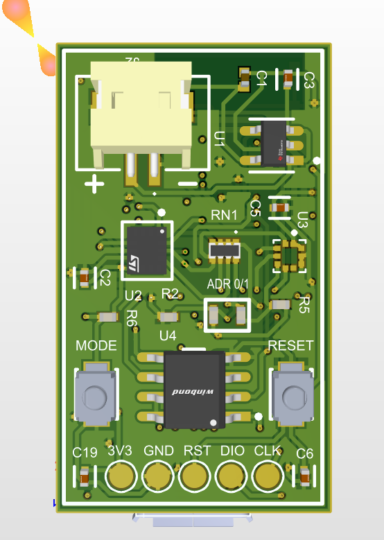
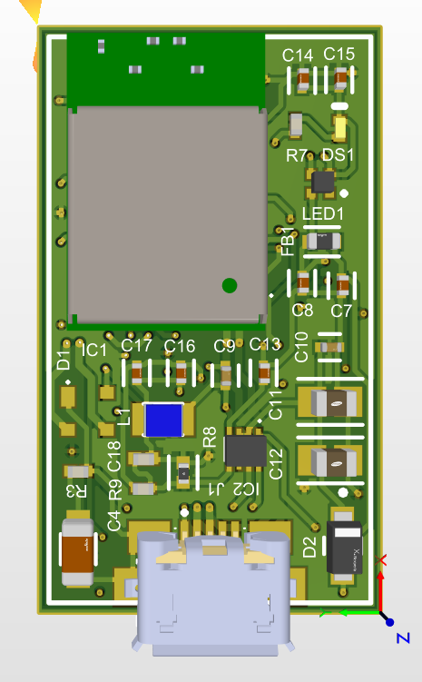
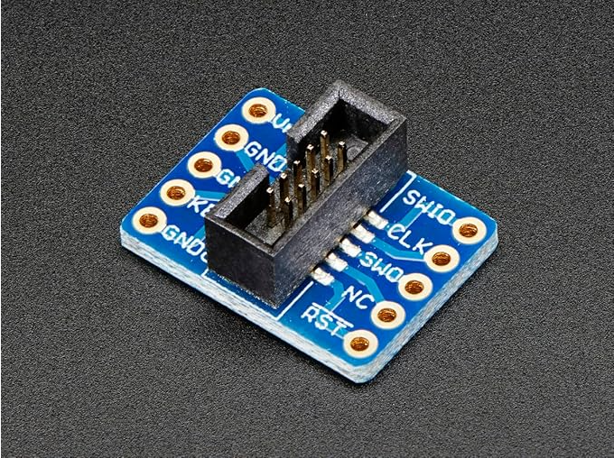

# :mountain_snow: Altimeter -- Firmware & Custom PCB Design


A portable altitude measurement device with **Bluetooth Low Energy and USB Serial** connectivity, featuring a **custom-designed PCB** with STM32/NRF52840 microcontroller, Winbond flash memory, and multiple firmware variants for different communication modes.

> See also: [Desktop App (Bluetooth)](https://github.com/zaeem7744/Altimeter_Desktop_App_Bluetooth) | [Desktop App (USB Serial)](https://github.com/zaeem7744/Altimeter_Desktop_App_USB_Serial)

---

## :camera: Custom PCB Design

### Board -- 3D Render (Altium Designer)
Compact PCB featuring microcontroller, Winbond flash memory, LiPo battery connector, MODE/RESET buttons, and SWD debug header (3V3, GND, RST, DIO, CLK).



### Board -- Component Layout


### SWD Breakout Board -- Programming & Debug Interface


---

## :wrench: Features

- **Barometric Altitude Measurement** -- Pressure-based altitude calculation with high accuracy
- **Dual Connectivity** -- Bluetooth Low Energy (BLE) and USB Serial communication modes
- **Multi-Platform Firmware** -- Separate firmware builds for ESP32, NRF52840, and USB Serial
- **Custom PCB** -- Designed in Altium Designer with production-ready Gerber outputs
- **Winbond Flash Memory** -- On-board data logging capability
- **SWD Debug Header** -- 3V3, GND, RST, DIO, CLK pins for programming and debugging
- **MODE/RESET Buttons** -- Physical controls for operation mode switching
- **LiPo Battery Powered** -- Portable operation with JST battery connector
- **Companion Desktop Apps** -- Real-time altitude visualization via BLE or USB

---

## :file_folder: Project Structure

```
Altimeter-Firmware-and-Design/
|-- Altimeter_Bluetooth_Firmware/    # BLE-based firmware (ESP32)
|-- Altimeter_Firmware_Serial_USB/   # USB Serial firmware variant
|-- Altimeter_NRF52840/              # NRF52840-specific BLE firmware
|-- Board Design/                    # Altium Designer PCB project
|   |-- Schematics
|   |-- PCB Layout
|   +-- Gerber outputs
|-- Documents/                       # 3D renders, pinout diagrams
|   |-- 1.png                        # Board 3D render (front)
|   |-- 2.png                        # Board component layout
|   +-- Breakout_Board_Pinout.png    # SWD debug breakout
+-- Final Delivery Altimeter/        # Production-ready package
```

---

## :hammer_and_wrench: Tech Stack

| Component | Technology |
|-----------|-----------|
| **MCUs** | ESP32, NRF52840 |
| **Language** | C/C++ |
| **Communication** | BLE (Bluetooth Low Energy), USB Serial |
| **Sensor** | Barometric pressure sensor (altitude) |
| **Flash** | Winbond SPI flash memory |
| **PCB Design** | Altium Designer |
| **Desktop Apps** | [BLE App](https://github.com/zaeem7744/Altimeter_Desktop_App_Bluetooth), [USB App](https://github.com/zaeem7744/Altimeter_Desktop_App_USB_Serial) |
| **Power** | LiPo battery |
| **Debug** | SWD interface (J-Link / ST-Link compatible) |

---

## :bust_in_silhouette: Author

**Muhammad Zaeem Sarfraz** -- Electronics & IoT Hardware Engineer

- :link: [LinkedIn](https://www.linkedin.com/in/zaeemsarfraz7744/)
- :email: Zaeem.7744@gmail.com
- :earth_africa: Vaasa, Finland
